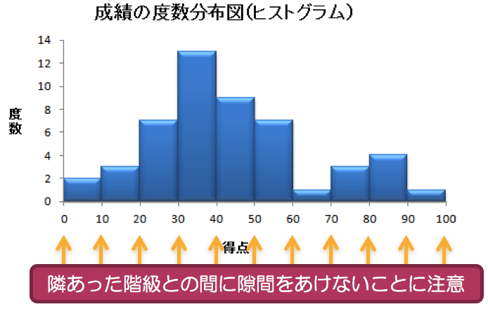

# データの尺度など

## データの尺度

*   データを作りあげている値にはさまざまな種類がある

> 例：ある大学の学生の成績・個人情報にかかわるデータ

|学生ID|学年|英語|ミクロ|$\cdots$|GPA|通学時間(分)|
|--|--|--|--|--|--|--|
|155001|3|S|A|$\cdots$|3.67|45|
|155002|3|C|B|$\cdots$|1.73|90|
| : | : | : | : |  | : | : | 
|名義 | 順序 | 順序 | 順序 | | 間隔 | 比例 |

$$
\text{変数}
\begin{cases}
\text{質的変数}
\begin{cases}
\text{名義尺度} & \text{同じ値かどうかを区別} \\
\text{順序尺度} & \text{値の大小関係のみ} \\
\end{cases} \\
\text{量的変数}
\begin{cases}
\text{間隔尺度} & \text{数値の間隔のみに意味がある} \\
\text{比例尺度} & \text{数値の間隔と比率に意味がある} \\
\end{cases}
\end{cases}
$$

## データの表記方法

## 幹葉図(Stem-and-Leaf)

>問題：学生の成績データ(幹葉図)  
>次の学生50人の成績データ(点数)で**幹葉図**を作成して下さい

|---|---|---|---|---|---|---|---|---|---|
| 5 | 9 | 15 | 15 | 17 | 24 | 25 | 25 | 27 | 29 |
|29 | 29 | 32 | 32 | 34 | 34 | 35 | 36 | 36 | 38 |
|38 | 39 | 39 | 39 | 39 | 43 | 44 | 44 | 44 | 45 |
|45 | 47 | 47 | 47 | 52 | 54 | 54 | 56 | 58 | 59 |
|59 | 67 | 73 | 75 | 79 | 82 | 84 | 84 | 89 | 99 |

> 定義：幹葉図(みきはず) 
>
*   データの値をいくつかのグループ(**幹**)に分け，各グループ内での値を**葉**のように幹の横に並べることで，データの分布状況を表現する方法。
*   データの分布だけでなく，データの値も表記するので，情報の損失がないことがこの方法の利点

$$
\mathop{2}_{\substack{\uparrow \\ \text{幹}}}
\mathop{9}_{\substack{\uparrow \\ \text{葉}}}
$$

しがたって幹葉図は次のようになります

| 10の位 | 1の位 | 
|--:|:--|
| 0 | 59 |
| 1 | 557 |
| 2 | 4557999 | 
| 3 | 2244566889999 |
| 4 | 344455777 |
| 5 | 2446899 |
| 6 | 7 |
| 7 | 359 |
| 8 | 2449 |
| 9 | 9 |

幹葉図からわかること

> 問題：学生の成績データ(中位数)  
> 学生は全員で50人でした。

*   点数の低い方から数えて25番目の学生の点数は何点ですか？
*   点数の高い方から数えて25番目の学生の点数は何点ですか？
*   全体のちょうど真ん中の点数は何点になりますか？

> 定義：中位数(メディアン, median) 
>データを大きさの順に並べたとき,ちょうど中央に位置するデータの値のこと

## 度数分布表

> 問題：学生の成績データ(度数分布表)  
> 学生50人の成績データ(点数)で\textcolor{red}{度数分布表}を作成して下さい。幹葉図との違いは何ですか？

**解答**

| 階級 | 度数 | 
|:-:|:-:|
| 0-9 | 2 |
| 10-19 | 3 |
| 20-29 | 7 |
| 30-39 | 13 |
| 40-49 |  9 |
| 50-59 | 7 |
| 60-69 | 1 |
| 70-79 |  3 |
| 80-89 | 4 |
| 90-99 | 1 |

> 定義：度数分布 
> 度数分布（frequency distribution）は，データを大きさによっていくつかの組（これを**級**または**クラス**〔class〕という）に分け，各級に入るデータの数（これを**度数**〔frequency〕という）を明らかにしたもの

*   利点：大量のデータの値の分布状況をみることができる
    *  10点以下に2人，90点代が1人，30点代に集中，という具合
*   欠点：級分けによってデータをまとめて表示しようとするので，細部の情報が失われてしまう
    *  情報の喪失は，データの要約の程度，つまり級の大きさによって異なるので，適切な級間隔の選択が重要
    *  100点満点の試験の結果なので、階級の幅（級間隔）を10点間隔にしているが，5点間隔でもよいかもしれない$\Rightarrow$適切な``幅''を決める方法はあるのか？

## ヒストグラム

> 問題：学生の成績データ(ヒストグラムの作成)  
>学生50人の成績データの度数分布を，視覚的にわかりやすく示すためにヒストグラム(histogram，度数柱状図)を作成して下さい

| 問題：学生の成績データ(ヒストグラムの作成)  
| 学生50人の成績データの度数分布を，視覚的にわかりやすく示すためにヒストグラム(histogram，度数柱状図)を作成して下さい

{width=50%}

> 定義：スタージス(Sturges)の公式による階級の幅の決め方 
>
1.  階級の数$m$を決定する：データ数が$n$のとき，適切な階級数$m$は
$$
m \approx 1+\frac{\log_{10} n}{\log_{10} 2} \approx 1+3.32 \log_{10} n
$$
なお，$\approx$は**ほぼ等しい**の意味。(参考：$\log_{10} 2 \approx 0.301$)
2.  階級の幅$c$を決定する：適切な級間隔$c$は
$$
c \approx \frac{x_{\max}-x_{\min}}{1+3.32 \log_{10} n}=\frac{\text{データの範囲}}{\text{階級数}}
$$

*   データの値の中で最も大きな値を``最大値(maximum)''，逆に最も小さな値を``最小値(minimum)''とよびます
*   最大値と最小値の間隔を``データの範囲(range)''とよびます

> 問題：学生の成績データ(スタージスの公式) 
> 学生50人の成績データ(単位：点数)では最低点は5点，最高点は99点でした。スタージスの公式を使って，適切な階級数$m$と階級の幅$c$を求めて下さい

**解答**

1.  スタージスの公式に必要な情報は次の通り

| 名称 | 記号 | 数値 |
|---|---|---|
| データ数 | $n$ | 50 |
| 最大値 | $x_{max}$ | 99 |
| 最小値 | $x_{min}$ | 5 |

2.  適切な階級の数$m$は
$$
m 
\approx 1+3.32 \times \log_{10} \mathop{50}_{\substack{\uparrow \\ n}}
\approx 1+3.32 \times 1.699
\approx 1+5.64 = 6.64
$$

3.  適切な級間隔$c$は
$$
c 
\approx \frac{\text{データの範囲}}{\text{階級数}}
\approx \frac{99-5}{7} 
\approx 13
$$

> 階級の数の決め方の注意点

1.  階級の「数」と「幅」は反比例の関係にある

| 階級の数 | 階級の幅 | ヒストグラム | 問題点 |
|---|---|---|---|
| 少なくする | 広くなる | 大雑把になる | 情報の喪失が大 |
| 多くする   | 狭くなる | 細かくなる   | 情報を集約できない |

2.  適切な階級の数と幅を決定するときにスタージスの公式を参考にするといい

3.  次のような幅を設定することがポイント
    1.  データ全体の傾向は損なわず、整理しやすい手頃な幅
    2.  級間隔が直感的に分かりやすい幅

### 度数分布表からわかること

> 問題：学生の成績データ(度数分布表の解釈) 
> 先ほど作成した学生の成績データの**度数分布表**を参照しながら以下の値を求めて下さい
>
1.  点数が30点台の学生は何人いますか？
2.  点数が30点台の学生は全体の何パーセントですか？
3.  50点未満の学生は何人いますか？
4.  50点未満の学生は何パーセントですか？

**解答**
1.  13人
2.  26パーセント
3.  34人
4.  68パーセント

> 問題：学生の成績データ(相対度数) 
> 点数が31点から40点の学生は全体の何パーセントですか？

$$
\text{30点台の階級の相対度数}
=\frac{\text{30点台の階級の度数}}{\text{全度数}}
=\frac{13}{50}=0.26
$$

> 定義：相対度数分布 
> **相対度数**の分布を表示したもの

| 階級(点) | 度数(人) | 相対度数 |  | 
| --:   | --: | :-:  | :-- |
|   0-9 |  2 | 0.04 | $\leftarrow 2/50$ | 
| 10-19 |  3 | 0.06 | $\leftarrow 3/50$ | 
| 20-29 |  7 | 0.14 | |
| 30-39 | 13 | 0.26 | $\leftarrow 13/50$ | 
| 40-49 |  9 | 0.18 | |
| 50-59 |  7 | 0.14 | |
| 60-69 |  1 | 0.02 | |
| 70-79 |  3 | 0.06 | |
| 80-89 |  4 | 0.08 | |
| 90-99 |  1 | 0.02 | |
| 合計  | 50 | 1.00 | |

