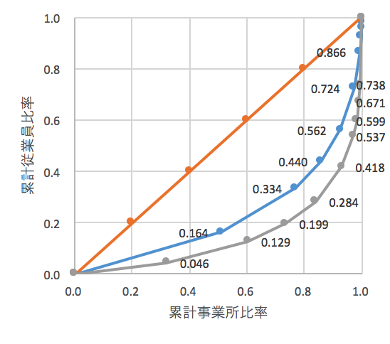

# ジニ係数の別の応用例

{width=100%}

*  事業所数と従業員数の累積相対比率を計算すると次表のようになります

{width=100%}

*  ローレンツ曲線は次のようになります

{width=100%}

> 問題 
>
*  繊維工業はどちらでしょうか？
*  どちらの方が集中度が高いでしょうか？また直感とあっていますか？ 
>
(解答：ジニ係数は繊維が0.5448，鉄鋼業が0.7003)

*  ヨコ軸の増加幅が等間隔でないため``高さ''の値がバラバラです
*  しかし必要な領域の面積は(若干面倒ですが)以前の例と同じ考え方で計算できます

## A section

All chapter sections start with a second-level (`##`) or higher heading followed by your section title, like the sections above and below here. You can have as many as you want within a chapter.

### An unnumbered section {-}

Chapters and sections are numbered by default. To un-number a heading, add a `{.unnumbered}` or the shorter `{-}` at the end of the heading, like in this section.
