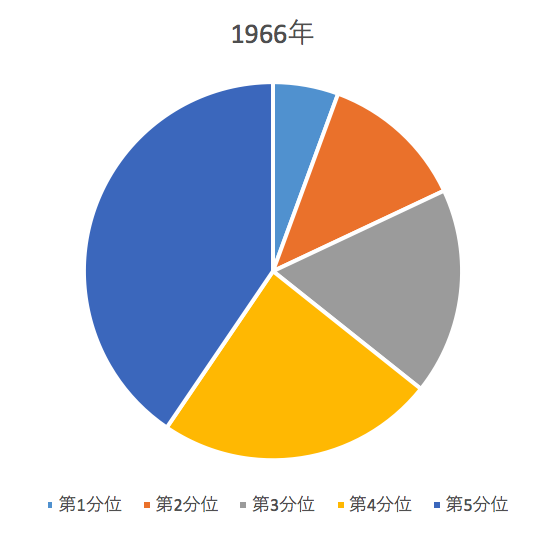
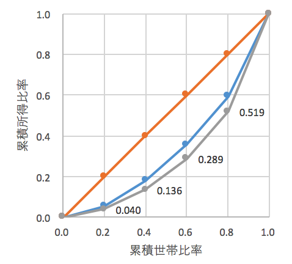

# ローレンツ曲線

> 定義：(所得の)5分位階級 
全ての世帯を所得の低い方から順番に並べ，それを世帯数で五等分して五つのグループを作った場合の各グループのことで，収入の低い方から順次第1，第2，第3，第4，第5分位階級とよぶ（参考：総務省，家計調査~用語の解説  http://www.stat.go.jp/data/kakei/kaisetsu.htm）

> 問題：アメリカの1966年時点の所得の分布 
次はアメリカの1966年時点の5分位階級別の所得の割合(%)を示したデータです。コメントして下さい。

| 所得階級 | 第1分位 | 第2分位 | 第3分位 | 第4分位 | 第5分位 |
| --- | --- | --- | --- | --- | --- |
| 1966年 | 5.6 | 12.4 | 17.7 | 23.8 | 40.5 |

出所：US Department of Commerce, Statistical Abstract of the United States

> 定義：円グラフ(パイチャート) 
> 360度の円を，100分比に応じて中心点から扇状に区切ったグラフ表現のこと。構成比を表すのに適したグラフ

{width=50%}

> 問題：アメリカの1966年時点の所得の分布 
世帯数と所得の累積比率を計算し，コメントして下さい

**解答**

|          | 所得分配 | 累積比率 | 累積比率 | 
| 所得階級 | 1966年   | 世帯数   | 所得  |
| --- | --- | --- | --- |
| 第1分位  | 0.056    | 0.200    | 0.056 |
| 第2分位  | 0.124    | 0.400    | 0.180 |
| 第3分位  | 0.177    | 0.600    | 0.357 |
| 第4分位  | 0.238    | 0.800    | 0.595 |
| 第5分位  | 0.405    | 1.000    | 1.000 |

*  第1分位は所得全体の5.6%
*  所得が低い方から6割の世帯(第3分位までの世帯)の所得は，全体の4割未満(35.7%)
*  所得が多い上位20%の世帯が，全所得の4割程度を獲得している

> 問題：アメリカの1966年時点の所得の分布 
1966年時点のアメリカの所得分配は不平等のように思えます。では逆に，完全に平等な場合の，(1)円グラフ，(2)累積比率はどうなりますか

{width=50%}

<!--  & & \multicolumn{2}{c}{累積比率} \\ -->
<!-- 所得階級 & 所得分配 & 世帯数 & 所得 \\ -->
<!-- \hline -->
<!-- 第1分位 & 0.200 & 0.200 & 0.200 \\ -->
<!-- 第2分位 & 0.200 & 0.400 & 0.400 \\ -->
<!-- 第3分位 & 0.200 & 0.600 & 0.600 \\ -->
<!-- 第4分位 & 0.200 & 0.800 & 0.800 \\ -->
<!-- 第5分位 & 0.200 & 1.000 & 1.000 \\ -->

> 問題：アメリカの1966年時点の所得の分布 
所得分配の不平等度を的確に表す方法は？

> 定義：ローレンツ曲線 
ローレンツ曲線(Lorenz curve)は，所得分布や資産分布などの格差，不平等度，集中度を明らかにするための代表的な方法で，1905年にアメリカの統計学者ローレンツ(M.O.Lorenz)によって考案されました

> 累積世帯比率と累積所得比率

<!--  & 累積世帯比率 & 累積所得比率 \\ -->
<!-- 所得階級 &  & 1966年実績 & 完全平等の場合 \\ -->
<!-- 第1分位 & 0.200 & 0.056 & 0.200 \\ -->
<!-- 第2分位 & 0.400 & 0.180 & 0.400 \\ -->
<!-- 第3分位 & 0.600 & 0.357 & 0.600 \\ -->
<!-- 第4分位 & 0.800 & 0.595 & 0.800 \\ -->
<!-- 第5分位 & 1.000 & 1.000 & 1.000 \\ -->

### ローレンツ曲線とジニ係数

{width=50%}

> ポイント 
>
1. 青線が1966年のデータから計算した**ローレンツ曲線**です
2. オレンジ線を**完全平等線**とよびます
3. **所得分配が平等化**してくるとローレンツ曲線は完全平等線に**接近**します
4. オレンジと青の線の間の**領域が広いほど不平等度が高く**なります
5. 2本の線に挟まれた**領域の面積の2倍の値をジニ係数**とよびます

> 確認問題：2005年のアメリカの所得分布 
2005年の数値を使ってローレンツ曲線を描き，結果についてコメントして下さい

<!-- 所得階級 & 第1分位 & 第2分位 & 第3分位 & 第4分位 & 第5分位 \\ -->
<!-- 2005年 & 4.0 & 9.6 & 15.3 & 23.0 & 48.1 \\ -->
<!-- 出所：US Department of Commerce, Statistical Abstract of the United States -->

**解答**

<!-- 所得階級 & 累積世帯比率 & 累積所得比率 \\ -->
<!-- \hline -->
<!-- 第1分位 & 0.200 & 0.040 \\ -->
<!-- 第2分位 & 0.400 & 0.136 \\ -->
<!-- 第3分位 & 0.600 & 0.289 \\ -->
<!-- 第4分位 & 0.800 & 0.519 \\ -->
<!-- 第5分位 & 1.000 & 1.000 \\ -->

{width=50%}

*  1969年から2005年にかけて，ローレンツ曲線は完全平等線からさらに離れている
*  このことから，1966年から2005年にかけて所得分布の不平等化が進んでいることがうかがわれる

## ジニ係数

> 定義：ジニ係数
>
1. ジニ係数(Gini coefficient)はローレンツ曲線のかたちを計測可能な指数にしたもので，(所得分配などの)分布の不平等度，集中度を示す指標です。
2. ジニ係数は**0から1のあいだの値**をとり，0に近いほど平等に近く，1に近いほど不平等度が大きいことを意味します

> ジニ係数の計算方法
>
1.   完全平等線より右下の領域(領域A)の面積は0.5
2.   ローレンツ曲線よりも右下の領域Bの面積を求める

\begin{align*}
\text{ジニ係数}
=(\text{領域Aの面積}-\text{領域Bの面積})\times 2
=1-\text{領域Bの面積}\times 2 
\end{align*}

>
3.   ローレンツ曲線よりも右下の領域の面積の計算方法

{width=50%}

*  領域を5分割し，三角形と台形の面積を求め，合計します

\begin{align*} 
&\tfrac{1}{2} \times \mathop{0.056}_{\substack{\uparrow \\ \text{底辺}}} \times \mathop{0.2}_{\substack{\uparrow \\ \text{高さ}}} \\
&+\tfrac{1}{2} \times (0.056+0.180) \times 0.2 \\
&+\tfrac{1}{2} \times (0.180+0.357) \times 0.2 \\
&+\tfrac{1}{2} \times (0.357+0.595) \times 0.2 \\
&+\tfrac{1}{2} \times (
\mathop{0.595}_{\substack{\uparrow \\ \text{上底}}}
+
\mathop{1.000}_{\substack{\uparrow \\ \text{下底}}}
) \times 
\mathop{0.2}_{\substack{\uparrow \\ \text{高さ}}} \\
&=0.3376
\end{align*}

4. よって1969年のジニ係数は
\begin{align*}
\text{ジニ係数}=1-0.3376\times 2=0.3248
\end{align*}

5.  領域Bの計算のコツ
*  今回の例では，5分位の世帯比率を使っているため，累積世帯比率は20\%ずつ等間隔で増加します。そのため面積を計算するときの``高さ''はすべて0.2です
*  さらに，三角形と台形の公式では$\tfrac{1}{2}$が共通です

*  これらの共通項を括り出せば

\begin{align*} 
&\tfrac{1}{2} \times \mathop{0.2}_{\substack{\uparrow \\ \text{高さ}}} \times 
\{ 0.056+ (0.056+0.180)+ (0.180+0.357) \\
&\qquad\qquad+(0.357+0.595)+(0.595+1.000) \} \\
&=0.3376
\end{align*}

> 確認問題：2005年のアメリカの所得分布 
2005年の数値を使ってジニ係数を計算して下さい

**解答**

1. 領域Bの面積は
\begin{align*}
\text{領域Bの面積}
&=\tfrac{1}{2} \times \mathop{0.2}_{\substack{\uparrow \\ \text{高さ}}} \times 
\{ 0.040+ (0.040+0.136) \\
&\qquad\qquad+(0.136+0.289)+(0.289+0.519) \\
&\qquad\qquad+(0.519+1.000) \} \\
&=0.2968
\end{align*}

2. したがって2005年のジニ係数は
\begin{align*}
\text{ジニ係数}
=1-2 \times 0.2968
=0.4064
\end{align*}

3. 解釈：ジニ係数の値は0.3248(1969年)から0.4064(2005年)へ上昇しており，所得分配の不平等化がすすんだ

