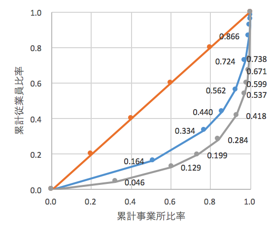
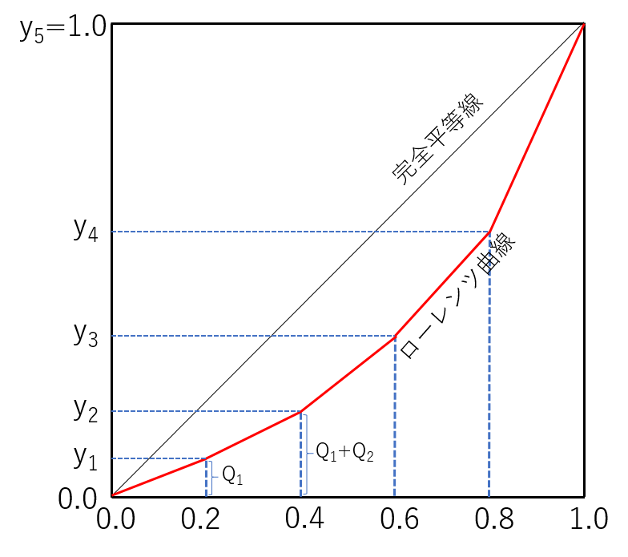

# ジニ係数の別の応用例

{width=100%}

*  事業所数と従業員数の累積相対比率を計算すると次表のようになります

{width=100%}

*  ローレンツ曲線は次のようになります

{width=100%}

> 問題 
>
*  繊維工業はどちらでしょうか？
*  どちらの方が集中度が高いでしょうか？また直感とあっていますか？ 
>
(解答：ジニ係数は繊維が0.5448，鉄鋼業が0.7003)

*  ヨコ軸の増加幅が等間隔でないため``高さ''の値がバラバラです
*  しかし必要な領域の面積は(若干面倒ですが)以前の例と同じ考え方で計算できます

## シグマ記号

> 重要な3つのルール 
>
*  ルール1
\begin{align*}
\sum_{i=1}^n (X_i+c)=\sum_{i=1}^n X_i+nc
\end{align*}
>
* ルール2
\begin{align*}
\sum_{i=1}^n c X_i=c \sum_{i=1}^n X_i
\end{align*}
>
* ルール3
\begin{align*}
\sum_{i=1}^n (a X_i+b)=a \sum_{i=1}^n X_i +nb
\end{align*}

**ルール１の確認**

一般的には大きさが$n$の標本 $\{ X_i \}=\{ X_1,X_2,\cdots,X_n \}$のそれぞれのデータに定数$c$を加えた新しいデータ $\{ X_i+c \}$の和は
\begin{align}
\sum_{i=1}^n (X_i+c)
&=(X_1+c)+(X_2+c)+\cdots+(X_n+c) \nonumber \\
&=(X_1+X_2+\cdots+X_n)+\underbrace{(c+c+\cdots+c)}_{\text{$n$個の$c$の合計}} \nonumber \\
&=\sum_{i=1}^n X_i+nc \label{(2.15)}
\end{align}
になります。

**ルール２の確認**

一般的には大きさが$n$の標本 $\{ X_i \}=\{ X_1,X_2,\cdots,X_n \}$のそれぞれのデータを$c$倍した新しいデータ $\{ c X_i \}$の和は
\begin{align}
\sum_{i=1}^n c X_i
&=c X_1+c X_2+\cdots+c X_n \nonumber \\
&=c (X_1+X_2+\cdots+X_n) \nonumber \\
&=c \sum_{i=1}^n X_i \label{(2.17)}
\end{align}
になります。

**ルール３の確認**

式(\ref{(2.15)})と式(\ref{(2.17)})を組合せると，大きさ$n$の標本 $\{ X_i \}$のそれぞれのデータを$a$倍し，さらにそれぞれに$b$を足しあわせた新しいデータ$\{ aX_i+b \}$の和を次のように計算できます。
\begin{align}
\sum_{i=1}^n (a X_i+b)
&=(a X_1+b)+(a X_2+b)+\cdots+(a X_n+b) \nonumber \\
&=\underbrace{(aX_1+aX_2+\cdots+aX_n)}_{a (X_1+X_2+\cdots+X_n)}+\underbrace{(b+b+\cdots+b)}_{\text{$n$個の$b$の合計}} \nonumber \\
&=a \sum_{i=1}^n X_i+nb \label{(2.18)}
\end{align}

> ジニ係数と５分位(Gini\_Quintile2021.tex)

1. 世帯を所得の低い方から順に並べ，世帯数で５等分し，それぞれを第I，第II，第III，第IV，第V五分位階級とよぶ。ここで横軸に累積世帯比率，縦軸に累積所得比率をとった座標平面において，次のローレンツ曲線のジニ係数を記号で表現する。

{width=80%}

| 所得階級         | 所得分配 | 世帯数 | 所得 |
|:-:|:-:|:-:|:-:|
| 第I 五分位階級   | $Q_1$ | 0.2 | $y_1$ |
| 第II 五分位階級  | $Q_2$ | 0.4 | $y_2$ |
| 第III 五分位階級 | $Q_3$ | 0.6 | $y_3$ |
| 第IV 五分位階級  | $Q_4$ | 0.8 | $y_4$ |
| 第V 五分位階級   | $Q_5$ | 1.0 | $y_5$ |

3.  $Q_i$は第$i$階級の所得割合。$y_i$は第$i$階級までの累積値。

*  ローレンツ曲線よりも右下の領域の面積はそれぞれ

\begin{align*}
\text{第I階級の部分の面積}
&=
\text{底辺}\times\text{高さ}\div 2 \\
&=
\mathop{y_1}_{\text{底辺} \times \mathop{0.2}_{\text{高さ} \times \frac{1}{2} =0.1 \times y_1}
\end{align*}

\begin{align*}
\text{第II階級の部分の面積}
&=
(\text{上底}+\text{下底})\times\text{高さ}\div 2
=(y_1+y_2) \times 0.2 \times \frac{1}{2}=0.1 \times (y_1+y_2)
\end{align*}

\begin{align*}
\text{第III階級の部分の面積}
&
=
(y_2+y_3) \times 0.2 \times \frac{1}{2}=0.1 \times (y_2+y_3)
\end{align*}

\begin{align*}
\text{第IV階級の部分の面積}
&
=
(y_3+y_4) \times 0.2 \times \frac{1}{2}=0.1 \times (y_3+y_4)
\end{align*}

\begin{align*}
\text{第V階級の部分の面積}
&
=(y_4+y_5) \times 0.2 \times \frac{1}{2} =0.1 \times (y_4+1)
\end{align*}

*  以上を合計すれば，ローレンツ曲線よりも右下の領域(領域B)の面積は

\begin{align*}
\text{領域Bの面積}&=
0.1 \times y_1
+0.1 \times (y_1+y_2)
+0.1 \times (y_2+y_3)
+0.1 \times (y_3+y_4)
+0.1 \times (y_4+1) \\
&=0.1 \times \{ y_1+(y_1+y_2)+(y_2+y_3)+(y_3+y_4)+(y_4+1) \} \\
&=0.1 \times ( 2y_1+2 y_2+2 y_3+2 y_4 +1 )
\end{align*}

*  ジニ係数は，完全平等線より右下の領域の面積（$1/2$）からローレンツ曲線よりも右下の領域の面積を引き，2倍したものなので

\begin{align}
\text{Gini係数}
&=\underbrace{2 \times 0.5}_{\text{領域Aの2倍}}
-
\underbrace{2 \times 0.1 \times ( 2y_1+2 y_2+2 y_3+2 y_4 +1 )}_{\text{領域Bの2倍}} \nonumber \\
&=1-(0.4y_1+0.4y_2+0.4y_3+0.4y_4+0.2)  \nonumber \\
&=0.8-0.4 \times ( y_1+y_2+y_3+y_4)  \label{gini_eq1}
\end{align}

*  ここで$y$と$Q$のあいだには次の関係があるので

\begin{align*}
y_1&=Q_1 \\
y_2&=Q_1+Q_2 \\
y_3&=Q_1+Q_2+Q_3 \\
y_4&=Q_1+Q_2+Q_3+Q_4
\end{align*}
このことから
\begin{align}
y_1+y_2+y_3+y_4=4 Q_1+3 Q_2+2 Q_3+Q_4 \label{gini_eq2}
\end{align}

*  したがって(\ref{gini_eq1})式と(\ref{gini_eq2})式から、ジニ係数は次の式により三角形や台形の面積を計算することなく，各五分位の所得分配の値からも直接計算できる。

\begin{align}
\text{Gini係数}
&=0.8-0.4 \times ( 4 Q_1+3 Q_2+2 Q_3+Q_4 ) \label{gini_eq3}
\end{align}

> 問題：次は1966年時点のアメリカの所得分布です。(\ref{gini_eq3})式を使ってジニ係数の値を求めて下さい。 

<!-- %\begin{table}[htp] -->
<!-- {\footnotesize -->
<!-- \begin{center} -->
<!-- \begin{tabular}{c|r||rr} -->
<!--  & 所得分配 & \multicolumn{2}{c}{累積比率} \\ -->
<!-- 所得階級 & 1966年 & 世帯数 & 所得 \\ -->
<!-- \hline -->
<!-- 第1階級 & 0.056 & 0.200 & 0.056 \\ -->
<!-- 第2階級 & 0.124 & 0.400 & 0.180 \\ -->
<!-- 第3階級 & 0.177 & 0.600 & 0.357 \\ -->
<!-- 第4階級 & 0.238 & 0.800 & 0.595 \\ -->
<!-- 第5階級 & 0.405 & 1.000 & 1.000 \\ -->
<!-- \end{tabular} -->
<!-- \end{center} -->
<!-- %\end{table}% -->
<!-- } -->

> 解答：ジニ係数は
>
\begin{align*}
\text{Gini係数}
&=0.8-0.4 \times ( 4 Q_1+3 Q_2+2 Q_3+Q_4 ) \\
&=0.8-0.4 \times ( 4 \times 0.056+3 \times 0.124+2 \times 0.177+0.238 ) \\
&=0.8-0.4 \times ( 0.224+0.372+0.354+0.238 ) \\
&=0.8-0.4 \times 1.188 =0.8-0.4752=0.3248
\end{align*}

> 参考文献：
Barro, R.J. (1999), Inequality, Growth and Investment, NBER Working Paper 7038.

> 応用例：偏差$\{ X_i-\bar{X} \}$の合計 

大きさ$n$の標本から計算した標本平均を
\begin{align*}
\bar{X}=\frac{1}{n} \sum_{i=1}^n X_i
\end{align*}
で表します。ここで標本平均はただ1つの値しかとらないので定数です。例えば$c=-\bar{X}$として式(\ref{(2.15)})のルールを適用すれば，偏差$\{ X_i-\bar{X} \}$の合計は以下のようになります。
\begin{align*}
\sum_{i=1}^n (X_i-\bar{X})
&=(X_1-\bar{X})+(X_2-\bar{X})+\cdots+(X_n-\bar{X}) \\
&=\underbrace{(X_1+X_2+\cdots+X_n)}_{\sum_{i=1}^n X_i}
+\underbrace{\{ (-\bar{X})+(-\bar{X})+\cdots+(-\bar{X}) \}}_{\text{$n$個の$-\bar{X}$の合計}}
\end{align*}
ここで
\begin{align*}
\bar{X}=\frac{1}{n}\sum_{i=1}^n X_i
\qquad \text{を書き換えれば} \qquad
\sum_{i=1}^n X_i=n \bar{X}
\end{align*}
となることに注目して下さい。したがって
\begin{align*}
\sum_{i=1}^n (X_i-\bar{X})
&=\underbrace{(X_1+X_2+\cdots+X_n)}_{\sum_{i=1}^n X_i}
+\underbrace{\{ (-\bar{X})+(-\bar{X})+\cdots+(-\bar{X}) \}}_{\text{$n$個の$-\bar{X}$の合計}} \\
&=\sum_{i=1}^n X_i-n \bar{X} \\
&=0
\end{align*}
となります。つまり「偏差の合計はゼロ」になります。
