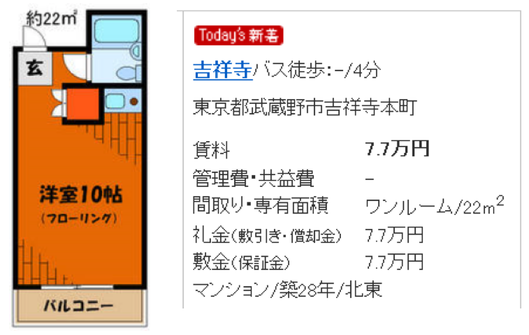

--- 
title: "初級統計学"
author: "TI"
date: "2023-03-07"
site: bookdown::bookdown_site
documentclass: book
bibliography: [book.bib, packages.bib]
# url: your book url like https://bookdown.org/yihui/bookdown
# cover-image: path to the social sharing image like images/cover.jpg
description: |
  This is a minimal example of using the bookdown package to write a book.
  The HTML output format for this example is bookdown::bs4_book,
  set in the _output.yml file.
biblio-style: apalike
csl: chicago-fullnote-bibliography.csl
---

# 編集用 {-}

https://bookdown.org/yihui/rmarkdown-cookbook/


# 統計と人間生活

日常生活では**統計的な考え方**がさまざまな場面で利用されている


> 例1：統計がないとスポーツ観戦がつまらなくなる<br>
> 野球では，過去の対戦成績(○勝△敗)，打撃成績（○割○分○厘），投手成績（防御率）のような**統計**が利用される
>
$$
\text{打率}=\frac{\text{安打}}{\text{打数}} \qquad\qquad
\text{防御率}=\frac{\text{自責点}}{\text{投球回}} \times 9
$$

これらの**統計**が存在しなければ：<br>
*   登場した打者にどれくらいの安打が期待できるのかわからない
*   投手にどれくらいの健闘が期待できるのかわからない


>例2：統計がないと今日の天気を比べられない<br>
>天気予報で気象予報士が「きょうは4月中旬にしては異常に暖かかった」あるいは「きょうは6月上旬の陽気であった」と表現することがある。

* 「異常」な状態を定義するには，「平常」な状態の定義が必要
*  ではどのように「平常」な状態を定義できるだろうか？
* 「平常」な気温は，過去何十年にもわたって観測した4月中旬の気温を平均してもとめた¥underline{平均気温}という統計数字
* 「異常」な暖かさとは「平常」な気温の値があってはじめて判断できる
*  疑問：平均気温よりもどれくらい離れていると「異常」と言えるだろうか？


> 例3：統計がなければ「当選確実」かどうかはすぐにわからない<br>
選挙速報で，数パーセントしか開票していないのに「当選確実」と報道できるのはなぜか？
¥end{exampleblock}

%¥pause

¥begin{itemize}
¥item 選挙前の支持者，投票意向などの統計的調査などから得た情報をもとに``推定''
¥item ¥underline{一部分の開票結果}から¥underline{全体の傾向}を推しはかる``統計的推論''とよばれる分析の応用例
¥end{itemize}


> 例4：企業経営に統計は不可欠 <br>
多くの製造業者は，注文を受けてから製品を製造する``受注生産''ではなく，どれくらい売れそうかという見込みをたてて製品を製造する``見込生産''を行っている
¥end{exampleblock}

%¥pause

¥begin{itemize}
¥item 生産量が多すぎれば``在庫''を抱えてしまうし，少なすぎたりすると社会的に混乱を生じさせてしまう
¥begin{itemize}
¥item 例：食品メーカーのある炭酸飲料が「予想を上回る注文があったため販売2日目で当面出荷停止」
%サントリーのオランジーナ 2015/4/2
¥end{itemize}

¥item 人口総数，男女別構成・年齢別構成等の統計をもとに需要予測を行い，生産量の計画をたてる
¥item 消費者の消費習慣や購買習慣を，企業みずから，あるいは専門の調査機関に依頼して``市場調査''する
¥end{itemize}


> 例5：経済政策の決定にも統計は不可欠 <br>
政府は所得税を減税することで消費を増加させ，公共投資を増やすことによって景気を刺激しようとする。政策を決定する際には，各種の経済統計(家計調査，設備投資計画調査など)が示す経済状態に細心の注意を払うと同時に，各種税率，公共投資額，金利，マネーストック等の経済政策にかかわる変数と経済の状態を示す各種変数との関係が利用されている
¥end{exampleblock}

%¥pause

¥begin{itemize}
¥item GDP，物価指数，金利，株価，失業率，為替レートなどのマクロ経済データを使って作成した計量経済学的モデルは，政府の経済政策の決定に不可欠なツールのひとつ

¥begin{alertblock}{内閣府の経済社会総合研究所の分析(2015)}
¥begin{itemize}
¥item 消費税率1¥%引上げで1年後の実質GDPは0.24¥%減少
¥item 短期金利1¥%引上げで1年後の実質GDPは0.32¥%減少
%¥item 内閣府経済社会総合研究所「短期日本経済マクロ計量モデル(2015年版)の構造と乗数分析」
%(http://www.esri.go.jp/jp/archive/e¥_dis/e¥_dis314/e¥_dis314.pdf)
¥end{itemize}
¥end{alertblock}
%¥begin{itemize}
%¥item 内閣府の経済社会総合研究所の分析によれば：
%¥item 消費税率1¥%$¥uparrow$で1年目の実質GDPは0.24¥%$¥downarrow$
%¥item 短期金利1¥%$¥uparrow$で1年目の実質GDPは0.32¥%$¥downarrow$
%%¥item 内閣府経済社会総合研究所「短期日本経済マクロ計量モデル(2015年版)の構造と乗数分析」
%%(http://www.esri.go.jp/jp/archive/e¥_dis/e¥_dis314/e¥_dis314.pdf)
%¥end{itemize}
¥end{itemize}


> 例6：アパート・マンションを選ぶときにも統計が使える <br>
> この物件を借りるべきか？

{width=50%}


%%%%%%%%%%%%%%%%%%%%%%%%%%%%%%%%%%%%%%%%%
¥begin{frame}¥frametitle{統計とは}
¥begin{block}{統計とは}
統計とは，ある特定の集団について，それを構成するものの特定の性質に注目して観察し，その集団全体の特徴を数量的に表現しようとするもの
¥end{block}

¥begin{enumerate}
¥item ¥textcolor{red}{記述}統計：複数の者，あるいは複数の時点で示した数字を集約整理し，その集団全体の¥textcolor{red}{特徴を示そうとする}もの

%¥pause
¥vspace{5mm}

¥item ¥textcolor{red}{推測}統計：一部から全体の¥textcolor{red}{特徴を推測・予測する}こと
¥end{enumerate}


> 質問<br>
> 先述の例を分類してみましょう
>
| |テーマ|種類|
|:-:|:-:|:-:|
|例1|スポーツ観戦|データの要約(平均的傾向)，記述|
|例2|異常な天気  |データの要約(ちらばり具合) |
|例3|選挙速報    |予測，推定 |
|例4|見込み生産  |予測，推定 |
|例5|経済政策    |記述，推定 |


Qiita マークダウン記法 一覧表・チートシート
https://qiita.com/kamorits/items/6f342da395ad57468ae3

This is a _sample_ book written in **Markdown**. You can use anything that Pandoc's Markdown supports; for example, a math equation $a^2 + b^2 = c^2$.

## Usage 

Each **bookdown** chapter is an .Rmd file, and each .Rmd file can contain one (and only one) chapter. A chapter *must* start with a first-level heading: `# A good chapter`, and can contain one (and only one) first-level heading.

Use second-level and higher headings within chapters like: `## A short section` or `### An even shorter section`.

The `index.Rmd` file is required, and is also your first book chapter. It will be the homepage when you render the book.

## Render book

You can render the HTML version of this example book without changing anything:

1. Find the **Build** pane in the RStudio IDE, and

1. Click on **Build Book**, then select your output format, or select "All formats" if you'd like to use multiple formats from the same book source files.

Or build the book from the R console:


```r
bookdown::render_book()
```

To render this example to PDF as a `bookdown::pdf_book`, you'll need to install XeLaTeX. You are recommended to install TinyTeX (which includes XeLaTeX): <https://yihui.org/tinytex/>.

## Preview book

As you work, you may start a local server to live preview this HTML book. This preview will update as you edit the book when you save individual .Rmd files. You can start the server in a work session by using the RStudio add-in "Preview book", or from the R console:


```r
bookdown::serve_book()
```


